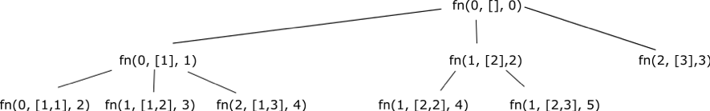

# Backtracking
The brute force solution would be to evaluate each possible combination and then check if the sum of the combination equals the target.  

We can optimize the brute force solution by using backtacking.  In brute force, we would need to evaluate every combination.  Backtracking lets you stop evaluating a possibility when you know it would not generate a valid solution.  In our case, if the sum of the combination is larger than the target, there is no way for the combination to be valid and we should stop evaluating that combination.

To use backtracking on this problem, store the current possible solution we are evaluating in the “current array.”  This means that the  current array stores the path currently being explored.  We will continue appending candidates onto the current array until either 1) the current array becomes invalid or 2) the current array is equal to the target.  In both cases, we want to backtrack – take a step back and explore a different candidate - because it would make no sense to keep exploring the path.  However, in case that the current array equals the target, we also want to add the current array to the “result array.”  

Since we are adding each valid path we find to the “result array”, once we have evaluated all potential paths, all valid onces will be in the “result array.”  The code can be found in Solution.java.

**Time Complexity: O(m^n)**
Where m is the length of the array, n is the length of the longest possible combination (target/ minimum element in the array).

If we draw the code path as a tree, the tree has m “branches” with depth of n.  This is because the backtracking times is called m times until reaching (in the worst case) m.  With a target of 3 and an input array of [1, 2, 3], the first few function calls would look like this:
 

The first level has m^0 leaves, the second level has m^1 leaves etc.  If we sum up each level is m^0 + m^1 + …. + m^n = m ^ (n+1) -1 = 0(m^n).  So the runtime is O(m^n).

**Space Complexity: O(n)**
If you don’t consider the space stored for the result, the space complexity is O(n) where n is the longest possible combination (target / minimum element in the array).
